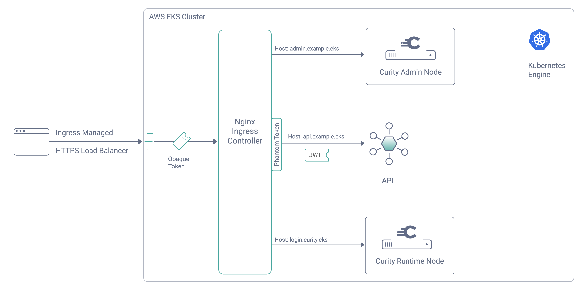

#  Curity Identity Server EKS Installation

[](https://curity.io/resources/code-examples/status/)
[](https://curity.io/resources/code-examples/status/)

This tutorial will enable any developer or an architect to quickly run the Curity Identity Server and the Phantom Token Pattern in Kubernetes using NGINX Ingress controller in the AWS Elastic Kubernetes Engine.

This installation follows the security best practice to host the Identity server and the APIs behind an Ingress controller acting as an Reverse proxy/API gateway. This will ensure that opaque access tokens are issued to internet clients, while APIs receive JWT access tokens.

## Prepare the Installation

Deployment on AWS EKS has the following prerequisites:
* [AWS Account](https://aws.amazon.com/premiumsupport/knowledge-center/create-and-activate-aws-account/) 
* [AWS CLI](https://docs.aws.amazon.com/cli/latest/userguide/getting-started-install.html) installed and configured.
* [Helm](https://helm.sh/)
* [kubectl](https://kubernetes.io/docs/tasks/tools/)
* [eksctl](https://docs.aws.amazon.com/eks/latest/userguide/eksctl.html)
* [OpenSSL](https://www.openssl.org/)
* [jq](https://stedolan.github.io/jq/) 

Make sure you have above prerequisites installed and then copy a license file to the `idsvr-config/license.json` location.
If needed, you can also get a free community edition license from the [Curity Developer Portal](https://developer.curity.io).


## Deployment Pattern

All of the services are running privately in the aws elastic kubernetes cluster and exposed via a https load balancer.



## Installation

 1. Clone the repository
    ```sh
    git clone git@github.com:curityio/curity-idsvr-aws-eks-demo-installation.git
    cd curity-idsvr-aws-eks-demo-installation
    ```


 2. Configuration
 
    Cluster options could be configured by modifying `cluster-config/eks-cluster-config.json` file. Please ensure that the region set in the `cluster-config/eks-cluster-config.json` must match the region set for aws cli (~/.aws/config).


 3. Install the environment  
    ```sh
    ./deploy-idsvr-aws-eks.sh --install
    ```   


4. Shutdown environment  
    ```sh
    ./deploy-idsvr-aws-eks.sh --stop
    ```  


5. Start the environment  
    ```sh
    ./deploy-idsvr-aws-eks.sh --start
    ```  


6. Clean up
    ```sh
    ./deploy-idsvr-aws-eks.sh --delete
    ```


7. Logs
    ```sh
     kubectl -n curity logs -f -l role=curity-idsvr-runtime
     kubectl -n curity logs -f -l role=curity-idsvr-admin  
     kubectl -n ingress-nginx logs -f -l app.kubernetes.io/component=controller
     kubectl -n api logs -f -l app=simple-echo-api
    ```


    ```sh
      ./deploy-idsvr-aws-eks.sh -h
      Usage: manage-environment.sh [-h | --help] [-i | --install]  [-d | --delete]

      ** DESCRIPTION **
      This script can be used to manage a eks cluster and Curity identity server installation.

      OPTIONS

      --help      show this help message and exit
      --install   creates eks cluster & deploys Curity identity server along with other components
      --start     starts the environment   
      --stop      shuts down the environment
      --delete    deletes the eks k8s cluster & identity server deployment
    ```
   

## Environment URLs

| Service             | URL                                                           | Purpose                                                         |
| --------------------|:------------------------------------------------------------- | ----------------------------------------------------------------|
| ADMIN UI            | https://admin.example.eks/admin                               | Curity Administration console                                   |
| OIDC METADATA       | https://login.example.eks/~/.well-known/openid-configuration  | Curity OIDC metadata discovery endpoint                         |
| EXAMPLE API         | https://api.example.eks/echo                                  | API endpoint protected by phantom-token flow                    |


For a detailed step by step installation instructions, please refer to [Installing the Curity Identity Server in AWS EKS](https://curity.io/resources/learn/kubernetes-aws-eks-idsvr-deployment) article.

## More Information

Please visit [curity.io](https://curity.io/) for more information about the Curity Identity Server.